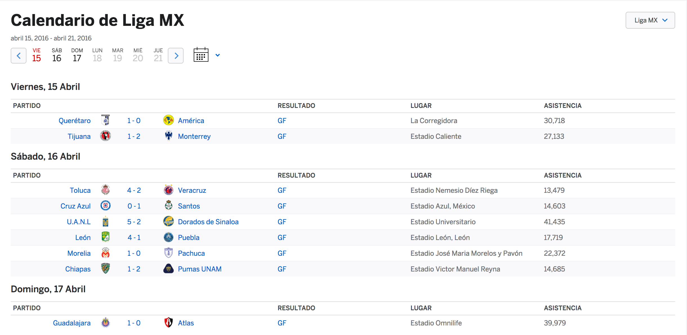

# ESPN LigaMX Match Parser

The espnParser.py will parse the ESPN Page<a href='http://espndeportes.espn.com/futbol/calendario?fecha=20160422&liga=mex.1&externalNav=true'> ESPN page</a> 
to gather the match outcome, and turns the data into JSON format.

###Example:

For a set of matches the page looks like:

The output (output data will be saved in [Data file])(Data)for the page above looks like the following in json.

[Data from April 15-17 2017](data-2017-04-16_to_2017-04-15.json)

###How to run:
* Year worth of data:
    
        $ espnParser.py 
        
* One day:
        
        $ espnParser.py 01/01/2015
        
* Date range:

        $ espnParser.py 01/01/2017 04/17/2017
